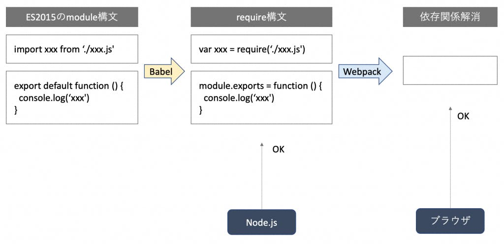

## JS `require`と`import`の違い

[参考サイト](https://www.wakuwakubank.com/posts/466-javascript-module-import-export/)



### require

#### 実行コマンド

```bash
$ node require-example/moduleA.js
Hello wakuwaku bank
```


#### 関数のエクスポート

```js:moduleA.js
const moduleB = require('./moduleB.js')

console.log(moduleB('wakuwaku bank'))
```

```js:moduleB.js
// NG
// exports = (name) => `Hello ${name}`

// OK
module.exports = (name) => `Hello ${name}`
```

moduleBはnameを引数にとって`Hello ${name}`を返す関数をexportしてる。
つまり、moduleBは、外部から関数として使えることになる！

------

#### 複数のエクスポート

```js:moduleC.js
const moduleD = require('./moduleD.js')

console.log(moduleD.hello('wakuwaku bank'))
console.log(moduleD.goodbye('wakuwaku bank'))
```

```js:moduleD.js
exports.hello = name => `Hello ${name}`
exports.goodbye = name => `Goodbye ${name}`
```

---

importはECMAScript2015からの仕様であるため、babelなどのpackageが必要。めんどくさかったから、正常に動く場合のコードと実行結果を記載。

```js:module.js
export const hello = name => `Hello ${name}`
export const goodbye = name => `Goodbye ${name}`
export const date = new Date()

export default name => `Default ${name}`
```

```js:index.js
import { hello, goodbye } from './module'; // 複数のimportする場合
// import * as xyz from './module'     全てをimportする場合
// import xyz from './module'          defaultをimportする場合

console.log(hello('wakuwaku bank'))
console.log(goodbye('wakuwaku bank'))
```

#### 実行コマンド

```bash
$ node import-example/index.js

Hello wakuwaku bank
Goodbye wakuwaku bank
```
